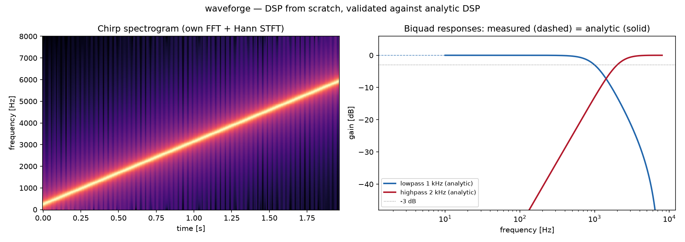

# waveforge


**A from-scratch DSP toolkit — FFT, oscillators, biquad filters, and WAV I/O —
validated against analytic signal processing, not just against itself.**



Left: a chirp spectrogram computed with waveforge's own FFT and a Hann-windowed
STFT. Right: biquad filter responses where the **measured** curve (FFT of the
impulse response, dashed) lands exactly on the **analytic** transfer function
(solid), crossing −3 dB at the cutoff.

## What's inside

| module | contents |
|---|---|
| `fft.py` | recursive radix-2 Cooley-Tukey FFT + Bluestein chirp-z for arbitrary lengths; inverse; naive DFT reference |
| `signals.py` | sine / square / sawtooth / linear chirp / white noise; Hann & Hamming windows |
| `filters.py` | direct-form biquads (RBJ cookbook lowpass/highpass, one-pole) with closed-form frequency response |
| `wav.py` | 16-bit PCM WAV read/write on the stdlib `wave` module |

## The validation story

DSP has clean analytic ground truth, and every core claim is checked against it:

- **FFT correctness** — the fast transform matches the O(N²) naive DFT *and*
  NumPy's FFT, for power-of-two lengths (radix-2) and arbitrary lengths
  (Bluestein), plus inverse round-trip, linearity, and **Parseval's theorem**
  (energy conservation) to 1e-9.
- **Filters** — the measured frequency response (FFT of the impulse response)
  matches the closed-form H(e^{jω}) to 1e-3; the Butterworth lowpass is verified
  −3 dB at its cutoff, unity at DC; the highpass nulls DC; and low/high tones
  are actually passed/blocked in steady state.
- **Signals** — a pure tone lands in exactly the expected FFT bin, the chirp's
  spectral centroid provably rises over time, the square wave is strictly
  bilevel, and WAV write→read round-trips to within one 16-bit quantization
  step.

## Install & use

```bash
pip install -e ".[dev]"
```

```python
import numpy as np
from waveforge import sine, biquad_lowpass, fft, write_wav

sr = 44100
tone = sine(440, sr, sr) + 0.3 * sine(880, sr, sr)
filtered = biquad_lowpass(600, sr).process(tone)
spectrum = np.abs(fft(filtered))
write_wav("out.wav", filtered, sr)
```

Regenerate the figure: `python examples/showcase.py`.

## Tests

```bash
pytest -q     # 46 tests against the naive DFT, NumPy, and analytic filter theory
ruff check .
```
